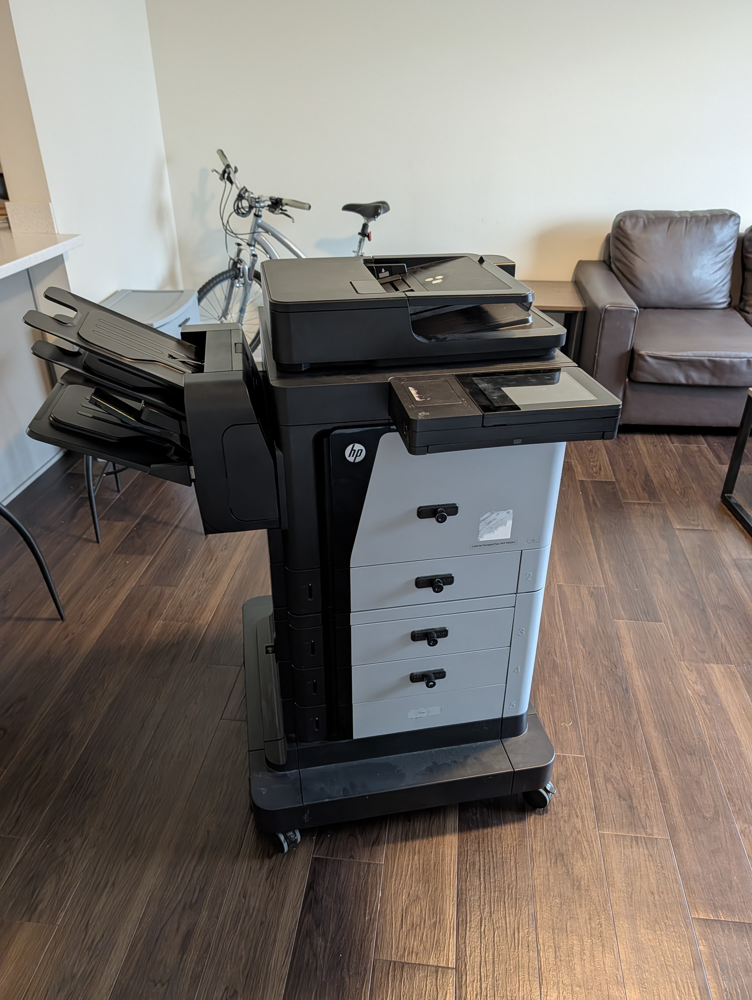

## The Origins of ししょ

Last semester while I was coming up with ideas for my website, I was inspired to add a reading list. I would update the list with books I planned on reading, was reading, and had completed. After making the list and implementing it, I ended up creating a database because Google's Books API rate limited me since it pulled book data on each website build, which could be a lot if I kept pushing changes during development. This lead to me wanting an easy way to update my reading list, going to GitHub, directly interacting with a database, or running a script wasn't ideal. So I made [**ししょ (Shisho)**](/en/projects/shisho), a discord bot to manage the reading list for me. And like all good things, it spiraled.

ししょ became a place to create notes and reminders because why not, I already have a database running. But then I didn't want to have to use discord to manage and see my reading list, so I made an [Android app](</en/projects/Shisho%20Companion%20(Android)>) (I eventually also made an iOS app at the request of a friend). So far a natural course of progression, though some might have gone for the mobile app first.

With the standard nature of a discord bot using structured input and iffy semantic word recognition, I added AI for ししょ to handle reminders. It could determine dates and what the reminder was by using a bit more context.

---

## What's next?

When I got back to campus, I thought.

> _What's next?_

I have other project ideas, sure, but I didn't feel like going down the rabbit hole of starting something else, yet. (I have another project in the works, it's exciting). What if I made ししょ more integral to my workflow?

---

## Expanding into an Assistant

I decided to create an AI assistant of sorts. Ask it questions, let it create reminders, look at my homework notes, my schedule, and what if it could have some sort of real-world interaction.

I spent a good couple of weeks refactoring and implementing new ideas. ししょ can now add books to my reading list by ISBN or just by giving it the name of the book and it will fetch all the book information for me. It can quickly create reminders from text, audio, and pictures. It can create notes for me, either in my database or even my Obsidian notebook, one of my favourite features.

ししょ has the ability to look at my class notes taken via Obsidian and perform actions. It can format my notes for me, that way I don't have to juggle facts and keeping it neat. By handing it a transcript of class, it can fill in any gaps and remind me of any important announcements and dates the professor talked about in class. It can also create flashcards for me by looking at my notes, no more spending hours making flashcards, just flipping through them.

---

## Real-World Interaction & Printing

Remember how I mentioned wanting some sort of real-world interaction? Well, last fall (6th of October 2025) I went to Purdue Surplus and saw a large laser printer. The kind offices have; multiple paper trays, scanning, and even stapling. (It took me a few weeks to get it working, buying a new toner drum, an SSD (yes, it needs a storage device), and loading up the firmware. Throughout the rest of the semester and through the spring semester (2026) I kept getting annoyed at how the network at my apartment had client-isolation and that I couldn't print while not at home, send the file while it's on my mind so that it's done and I don't forget about it.) Over the summer (2026) I made an [**"Email to Print"**](/en/projects/Email%20to%20Print) service that runs 24/7 monitoring an email inbox and printing whatever file it receives to a connected printer.

With ししょ existing, why not integrate them? So I created another database for a print queue and had both ししょ and my printing service hook into it. I of course added a fallback for ししょ to use email if there's a database issue. Now I can simply send a message saying `"print this"` with a document attached and ししょ will happily print it for me. It can of course print anything else I tell it to, like my notes, or even to print out random facts.

But why stop at being able to tell my assistant to simply print out documents. Next up is having it generate and print out a list of daily tasks for me using a receipt printer.

---

## Looking Ahead

There's so much more to do though.

What if it could automatically pull all of my school assignments, look at my calendar, and automatically schedule time for me to work on my assignments. It could even learn how long it takes for me to complete various assignments and adjust scheduling. I could even give it my finished assignments and submits it for me.

### SO MANY IDEAS!
